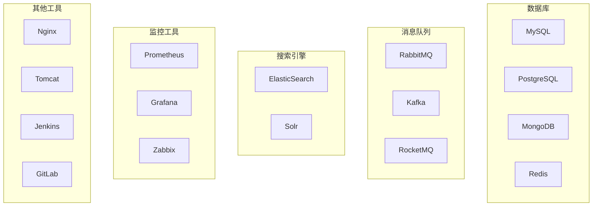

# 🐳 demo-awesome_docker_software - Docker软件合集


## 📖 项目简介

demo-awesome_docker_software是Docker常用软件配置合集,提供各种常用软件的Docker和Docker Compose配置文件,包括数据库、消息队列、搜索引擎、监控工具等。

## 🏗️ 系统架构



## 🚀 快速开始

```bash
# 克隆项目
git clone https://github.com/yourusername/demo-awesome_docker_software.git

# 进入软件目录
cd mysql

# 启动服务
docker-compose up -d
```

## 💡 核心示例

### MySQL配置

```yaml
version: '3.8'
services:
  mysql:
    image: mysql:8.0
    container_name: mysql
    environment:
      MYSQL_ROOT_PASSWORD: root123
      MYSQL_DATABASE: mydb
    ports:
      - "3306:3306"
    volumes:
      - ./data:/var/lib/mysql
      - ./my.cnf:/etc/mysql/my.cnf
    restart: always
```

### Redis配置

```yaml
version: '3.8'
services:
  redis:
    image: redis:7-alpine
    container_name: redis
    ports:
      - "6379:6379"
    volumes:
      - ./data:/data
    command: redis-server --appendonly yes
    restart: always
```

## 📦 包含软件

- **数据库**: MySQL, PostgreSQL, MongoDB, Redis
- **消息队列**: RabbitMQ, Kafka, RocketMQ
- **搜索引擎**: ElasticSearch, Solr
- **监控工具**: Prometheus, Grafana
- **其他**: Nginx, Jenkins, GitLab

## 📝 更新日志

### v1.0.0 (2024-01-01)
- ✨ 初始版本发布
- ✨ 添加常用数据库配置
- ✨ 添加消息队列配置
- ✨ 添加监控工具配置

---

⭐ 如果这个项目对你有帮助,欢迎Star支持!
